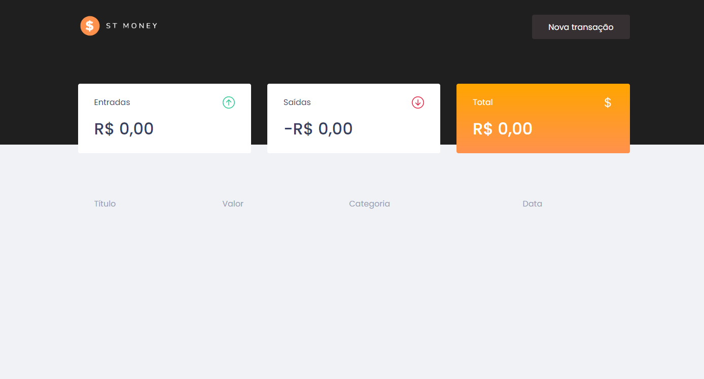
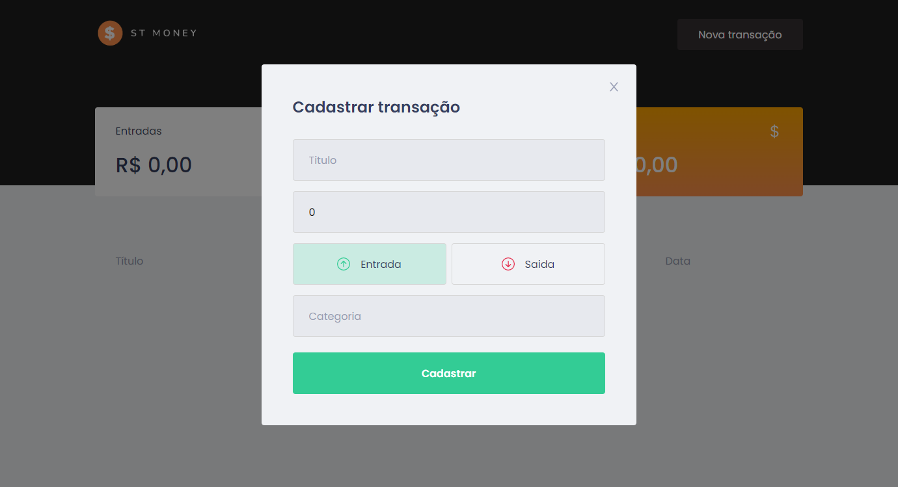

# st-money
ST Money é o seu gerenciador financeiro feito com Typescript.

# Sobre o formulário

🍃 O site foi feito em ReactJS com Typescript.

🍃 O usuário cadastra seus gastos e seus lucros e o site os mantém salvos na aplicação.

🍃 Para estilização usei styled-components.

🍃 Além disso tem uso de react-icons, MirageJS e outras libs.

## 📷 Fotos do projeto

Página inicial antes de qualquer cadastro.

Modal para cadastro do usuário.

Página final após os cadastros.

## 🖥️Tecnologias que usei:

- [React](https://reactjs.org/)
- [TypeScript](https://www.typescriptlang.org/)
- [Styled Components](https://styled-components.com/)
- [MirageJS](https://miragejs.com/)
- [Axios](https://github.com/axios/axios)
- [Polished](https://polished.js.org/)

 

